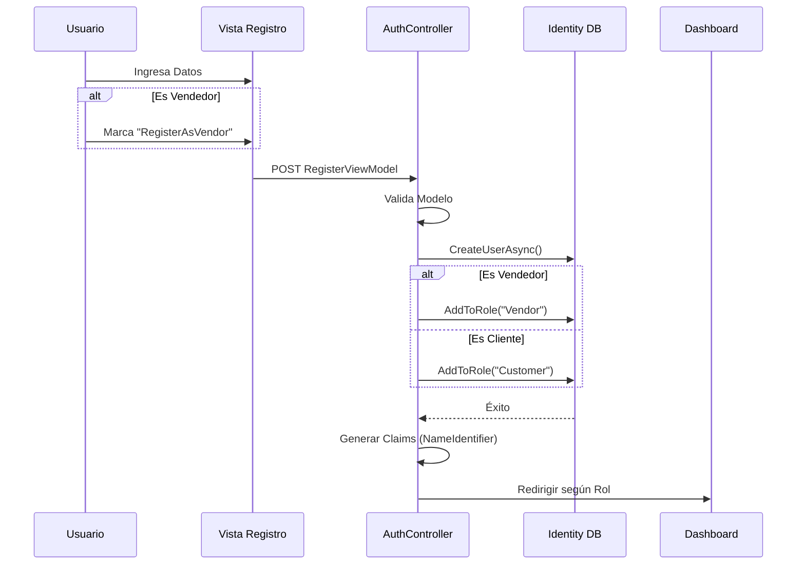
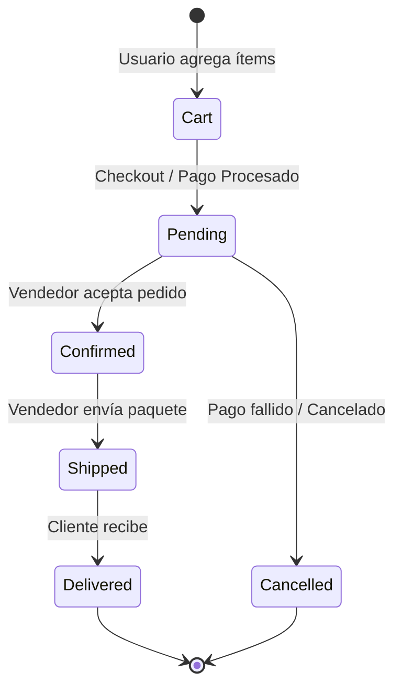

# Manual Técnico de Referencia: Plataforma de Comercio Electrónico de Joyería (ECommerceApp)

> **Versión del Documento:** 1.0  
> **Fecha de Revisión:** 27 de Noviembre de 2025  
> **Fuente:** Repositorio `MaikyAhoyo/ECommerceApp`

---

## Índice de Contenidos

1. [Introducción y Alcance](#1-introducción-y-alcance)
2. [Arquitectura del Sistema](#2-arquitectura-del-sistema)
3. [Pila Tecnológica](#3-pila-tecnológica)
4. [Gestión de Roles y Seguridad](#4-gestión-de-roles-y-seguridad)
5. [Componentes del Núcleo](#5-componentes-del-núcleo)
6. [Infraestructura de Datos](#6-infraestructura-de-datos)
7. [Flujos de Negocio Críticos](#7-flujos-de-negocio-críticos)
8. [Arquitectura de Datos y ViewModels](#8-arquitectura-de-datos-y-viewmodels)
9. [Conclusiones Clave](#9-conclusiones-clave)
10. [Glosario Técnico](#10-glosario-técnico)

---

## 1. Introducción y Alcance

### 1.1 Propósito del Sistema
La aplicación **ECommerceApp** es una solución de mercado digital (*Marketplace*) especializada en joyería, diseñada para facilitar la comercialización de productos de oro, plata y platino. El sistema opera bajo un modelo de **múltiples vendedores (multi-vendor)**, permitiendo una gestión centralizada del ciclo de vida del comercio electrónico, desde el descubrimiento de productos hasta el cumplimiento de pedidos y análisis de ventas.

### 1.2 Alcance Funcional
El alcance del sistema abarca tres áreas operativas principales, cada una con interfaces dedicadas:

* **Experiencia del Cliente:** Navegación, gestión de carrito, proceso de pago (*checkout*) con validación de stock, seguimiento de pedidos y sistema de reseñas.
* **Gestión de Vendedores:** Portal para administración de inventario (CRUD), gestión de pedidos y paneles analíticos.
* **Administración de Plataforma:** Supervisión global de usuarios y reportes del sistema.

---

## 2. Arquitectura del Sistema

El sistema implementa un patrón de arquitectura **MVC (Modelo-Vista-Controlador)** de tres capas, diseñado para asegurar la separación de responsabilidades y la escalabilidad modular.

### 2.1 Estructura Lógica

1.  **Capa de Presentación (Controllers & Views):** Maneja la interacción del usuario y la lógica de presentación.
2.  **Capa de Servicio (Services):** Encapsula la lógica de negocio compleja y actúa como intermediario.
3.  **Capa de Datos (Data Layer):** Gestiona la persistencia y recuperación de información a través del ORM.

```mermaid
graph TD
    subgraph "Capa de Presentación"
    UI[Vista / UI] <-->|Datos| C[Controladores]
    end
    
    subgraph "Capa de Servicios"
    C <-->|DTOs/Modelos| S[Servicios (Lógica de Negocio)]
    end
    
    subgraph "Capa de Datos"
    S <-->|Entidades| EF[Entity Framework Core]
    EF <-->|SQL| DB[(SQL Server)]
    end
    
    style UI fill:#e1f5fe,stroke:#01579b
    style S fill:#fff9c4,stroke:#fbc02d
    style DB fill:#e0f2f1,stroke:#00695c
```

---

## 3. Pila Tecnológica

La infraestructura técnica se basa en el ecosistema Microsoft .NET, complementado con tecnologías estándar de frontend.

| Componente | Tecnología Seleccionada | Detalle de Configuración |
| :--- | :--- | :--- |
| **Framework Backend** | ASP.NET Core MVC | Marco principal de la aplicación web. |
| **Base de Datos** | SQL Server | Instancia: `MaikyAhoyo` |
| **ORM** | Entity Framework Core | Abstracción de acceso a datos. |
| **Autenticación** | ASP.NET Core Identity | Autenticación basada en Claims (`ClaimTypes.NameIdentifier`). |
| **Frontend** | Tailwind CSS, jQuery | Estilizado utilitario e interactividad del lado del cliente. |

---

## 4. Gestión de Roles y Seguridad

El sistema implementa un **Control de Acceso Basado en Roles (RBAC)** estricto. Cada rol interactúa con el sistema a través de controladores y rutas prefijadas específicas.

### 4.1 Matriz de Roles y Capacidades

| Rol | Controlador Primario | Prefijo de Ruta | Capacidades Principales |
| :--- | :--- | :--- | :--- |
| **Cliente** | `CustomerController` | `/customer` | Descubrimiento, compras, seguimiento, reseñas. |
| **Vendedor** | `VendorController` | `/vendor` | Gestión de productos, inventario, dashboard. |
| **Admin** | `AdminController` | `/admin` | Gestión de usuarios, reportes globales. |

### 4.2 Flujo de Autenticación

1.  **Registro:** El usuario se registra mediante `RegisterViewModel`. Se utiliza una bandera booleana `RegisterAsVendor` para determinar el rol inicial.
2.  **Asignación:** El sistema asigna el rol correspondiente en la base de datos de Identity.
3.  **Sesión:** Se generan *Claims* de autenticación, almacenando el ID de usuario en `ClaimTypes.NameIdentifier`.
4.  **Verificación:** Los controladores recuperan el contexto del usuario mediante métodos auxiliares como `GetCurrentUserId()`.



---

## 5. Componentes del Núcleo

### 5.1 Controladores (Capa de Presentación)
Los controladores actúan como orquestadores principales, delegando la lógica a los servicios.
* **CustomerController:** El componente más complejo, con más de 27 métodos de acción. Gestiona todo el flujo de compra.
* **VendorController:** Maneja las operaciones administrativas de los vendedores (inventario y despachos).

### 5.2 Capa de Servicios (Lógica de Negocio)
El sistema define 7 interfaces clave para desacoplar la lógica:
* `IProductService`: Catálogo y stock.
* `IOrderService`: Ciclo de vida de pedidos y carritos.
* `IReviewService`: Sistema de calificación (1-5 estrellas).
* `IShippingAddressService`: Logística de direcciones.
* `IPaymentService`: Abstracción de pasarelas de pago.
* `ICategoryService`: Taxonomía de productos.
* `IUserService`: Gestión de cuentas.

### 5.3 Entidades de Dominio
Las clases principales que modelan el negocio:
* **Product:** Propiedades específicas como tipo de metal y pureza.
* **Order:** Entidad dual (funciona como Carrito o Pedido según su estado).
* **Otros:** `OrderItem`, `Review`, `User`, `ShippingAddress`, `Category`.

---

## 6. Infraestructura de Datos

### 6.1 Configuración de Conexión
La conexión a la base de datos se define en `appsettings.json`. Es crítica para el funcionamiento del ORM.

**Ejemplo Técnico: Cadena de Conexión**

```json
"ConnectionStrings": {
  "DefaultConnection": "Server=MaikyAhoyo;Database=Jewelry;Trusted_Connection=True;TrustServerCertificate=True;MultipleActiveResultSets=true"
}
```

**Análisis de Parámetros:**
* `Trusted_Connection=True`: Utiliza Autenticación de Windows.
* `TrustServerCertificate=True`: Deshabilita la validación SSL (común en desarrollo, riesgo en producción).
* `MultipleActiveResultSets=true`: Permite múltiples consultas concurrentes en una sola conexión.

---

## 7. Flujos de Negocio Críticos

### 7.1 Gestión de Stock y Concurrencia
El proceso de checkout implementa una reducción de stock "optimista".
1.  El usuario inicia el pago.
2.  El sistema reduce el stock temporalmente.
3.  **Validación:** Si el pago falla, se ejecuta una operación de *Rollback* para restaurar el inventario.

### 7.2 Ciclo de Vida del Pedido
La entidad `Order` transita por una máquina de estados definida:



### 7.3 Conversión Carrito-Pedido
Técnicamente, no existe una tabla separada para "Carrito". Se utiliza la tabla `Orders` con el estado `Status="Cart"`. Al finalizar la compra, este registro simplemente actualiza su estado a `Pending`, optimizando el almacenamiento de datos.

---

## 8. Arquitectura de Datos y ViewModels

Para mantener la integridad de los datos y evitar la exposición directa de las entidades de base de datos, se utiliza un sistema robusto de ViewModels, centralizados en el archivo `AllViewModels.cs`.

### 8.1 Categorización de Modelos

**Modelos de Cliente (Customer)** *Diseñados para la experiencia de compra:*
* `CustomerProductsViewModel`: Listados con filtros y paginación.
* `CustomerCartViewModel`: Cálculos de totales y líneas de pedido.
* `CustomerCheckoutViewModel`: Agregación de direcciones y métodos de pago.

**Modelos de Vendedor (Vendor)** *Enfocados en métricas y gestión:*
* `VendorDashboardViewModel`: KPIs de ventas y estadísticas.
* `VendorInventoryViewModel`: Control de stock y alertas.

**Modelos de Producto y Reseñas**
* `ProductCreateViewModel`: Formularios de alta con selección de categorías.
* `ReviewCreateViewModel`: Sistema de feedback con validación de rango (1-5).

---

## 9. Conclusiones Clave

* **Centralización de Lógica:** La alta dependencia en `CustomerController` (con más de 27 acciones) sugiere que es el núcleo operativo del sistema, centralizando la mayor parte de la lógica de cara al usuario.
* **Eficiencia en Datos:** El uso dual de la entidad `Order` para manejar tanto carritos como pedidos confirmados simplifica el modelo de datos y reduce la redundancia.
* **Seguridad por Diseño:** La segregación estricta de controladores por rol (`/admin`, `/vendor`, `/customer`) facilita la implementación de políticas de autorización y reduce la superficie de ataque.
* **Escalabilidad:** La arquitectura de servicios (`IProductService`, etc.) permite reemplazar o mejorar la lógica de negocio sin afectar la capa de presentación, facilitando el mantenimiento futuro.

---

## 10. Glosario Técnico

* **ASP.NET Core Identity:** Sistema de membresía que añade funcionalidad de inicio de sesión a aplicaciones ASP.NET Core.
* **Claims:** Declaraciones sobre un usuario (como su nombre, rol o ID) que se utilizan para la autorización.
* **Entity Framework Core (EF Core):** ORM ligero, extensible y multiplataforma de Microsoft.
* **MARS (Multiple Active Result Sets):** Característica de SQL Server que permite la ejecución de múltiples lotes en una sola conexión.
* **MVC (Modelo-Vista-Controlador):** Patrón de diseño que separa una aplicación en tres componentes principales lógicos.
* **ORM (Object-Relational Mapper):** Técnica para convertir datos entre sistemas de tipos incompatibles en programación orientada a objetos (la base de datos y el código C#).
* **ViewModel:** Modelo que representa los datos que se mostrarán en una Vista, desacoplando la UI del modelo de dominio de la base de datos.
